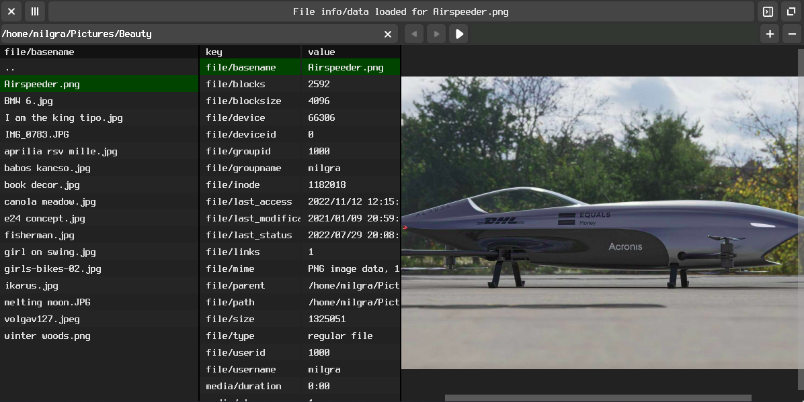

# MultiMedia File Manager

MultiMedia File Manager is a modern, lightning fast media viewer and manager for multimedia and document files. It can play and view everything ffmpeg and mupdf can.

MultiMedia File Manager was made for [SwayOS](https://swayos.github.io).

[](https://www.youtube.com/watch?v=CiP0LhNWZGw)

Watch the introduction/user guide [video on youtube](https://www.youtube.com/watch?v=CiP0LhNWZGw)  
Or read the user guide for further information : [Open User Guide](MANUAL.md)

## Features ##

- It aims to be the fastest & most responsive doc/media viewer out there
- Optimized both for keyboard and touchpad use
- MacOS-like scroll and pinch smoothness
- Instant preview for all known media formats and for pdf files
- Beautiful and smooth UX experience
- Written in super fast headerless C
- Super detailed file info - extracts all info available via stat and file commands and ffmpeg stream info
- Visual Pasteboard, drop files and folders there for later reuse or create folders for collecting files
- Activity bar for transparent background processes
- Super lightweight, uses its own UI renderer (no QT/GTK )
- Fully automated UI testing to avoid bugs before release

## Long description ##

MultiMedia File Manager is a modern, lightning fast media viewer and manager for multimedia and document files. It can play and view everything ffmpeg and mupdf can. It was created to make multimedia and document file organization a breeze.
If you move over a file with arrow keys or the select a file with the mouse it immediately shows its content/starts playing. If autoplay annoys you just switch autoplay off with space or with the play/pause button.
The file informaton also shows up immediately in the file info view.
You can freely resize any content inside the preview area with touchpad pinch gestures, with the scroll wheel, with plus/minus keys and the plus/minus buttons on the toolbar.
With a right click over the file list view or by pressing CTRL-V the file operation context menu pops up. You can delete and rename files from here, create a new folder and handle the clipboard from here.
The clipboard table is a crucial part of MultiMedia File Manager. You can open it by pressing the sidebar button or pressing CTRL+S. Here you can create a virtual list of files you want to work with. To send a file here select "Send file to clipboard" from the file operations context menu, or press CTRL+C over the file, or drag and drop the files here.
To reset the clipboard, select "Reset clipboard" from the file operations context menu.
To use these files in the file list view, select "Paste using copy" or "Paste using move" from the file ops menu or drag and drop files from the clipboard table on the file list table.
MMFM's UI can be structured via html, styled via css.

## Installation ##

Install the needed dependencies and libraries:

```
git meson ninja-build pkg-config - build tools
libgl,libglew,libegl,libwegl,libgles2,libfreetype,libxkbcommon,wayland-client,wayland-protocols - for rendering the ui and handling key events
libpng,libjpg,libjbig2dec,libopenjp2,libharfbuzz - mupdf related
libavutil,libavcodec,libavdevice,libavformat,libavfilter,libswscale,libswresample,libsdl2 - for media encode/decode
mupdf,mupdf-third,mujs,gumbo - pdf rendering
fonts-terminus - for default font
````

On debian based systems :
```
sudo apg-get install git meson ninja-build pkg-config libpng-dev libfreetype-dev libgl-dev libegl-dev libglew-dev libwayland-dev libxkbcommon-dev wayland-protocols libgles2-mesa-dev libsdl2-dev libswscale-dev libjpeg-dev libjbig2dec-dev libopenjp2-7-dev libharfbuzz-dev libavutil-dev libavdevice-dev libmupdf-dev libmujs-dev libgumbo-dev

```

On arch based systems :
```
sudo pacman -Qs git meson pkg-config ninja glew wayland-protocols libpng freetype2 libgl libegl wayland wayland-protocols libxkbcommon ffmpeg libmupdf mujs
```

Then run these commands:

```
git clone https://github.com/milgra/mmfm.git
cd mmfm
meson build --buildtype=release
ninja -C build
sudo ninja -C build install
```

### Usage on floating window managers (GNOME,KDE) ###

Move the window by pressing your META key ( WIN key usually ) and drag on the window. Resize by dropping on the left or right side of the desktop.

## Technical Info ##

MMFM was written in Headerless C. It is about using the __INCLUDE_LEVEL__ preprocessor macro available in GCC/CLANG to guard the implementation part of a source file so you can place it together with the header definition in a single file and you include this file freely in other source files. Read more about this in (https://github.com/milgra/headerlessc);

MMFM uses Kinetic UI as UI/Widget rendering engine. It is a modern, minimal ui renderer with html/css based stylimg written in headerless C. It offers MacOS like smooth kinetic animations and font-level animatioms, gpu or cpu based alpha blending, wayland connector with window and layer support and deterministic session record and replay for fully automated application testing.

MMFM uses the mt_core library for retain counted memory management, retain counted and recursively observable vector and map containers and helper functions.

MMFM uses meson and ninja for lightning fast compilation.

## Libraries used - Thanks for creating these! ##

- FFMPEG / media playing and parsing
- mupdf / pdf rendering
- SDL2 / audio handling
- freetype / text generation
- Neil Hanning's utf8.h / case-insensitive utf8 comparison

## License ##

MultiMedia File Manager is released under the GPLv3 (or later) license.